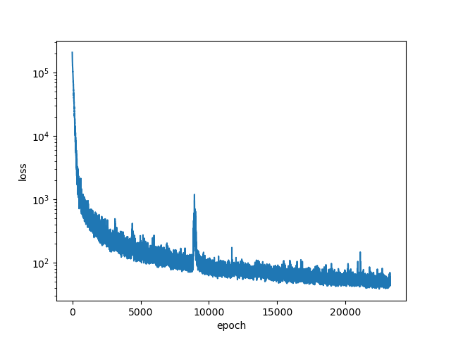
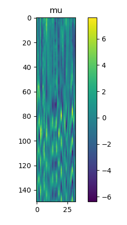
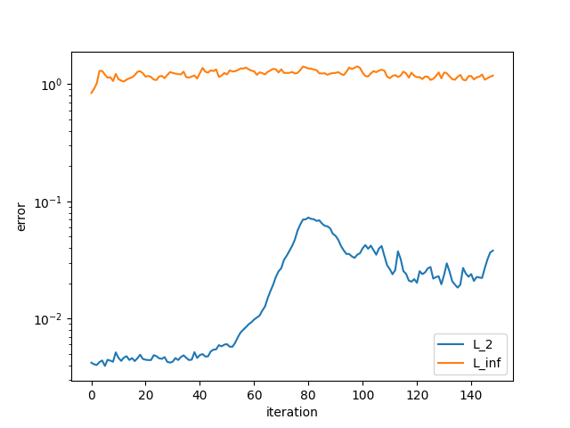

# Variational Auto Encoder with CFD
A simulation of wake behind cylinder. dimensionality reduction by variational auto encoder


## Introduction

### 1. Numerical simulation of wake behind a cylinder
This is a simple simulation of wake behind a cylinder. 
The simulation is done using Lattice Boltzmann Method. ( see `cylinder.cpp` )

The simulation is done for five different Reynolds numbers($Re = 5, 40, 60, 100, 200$). 

### 2. Dimensionality reduction by Variational Auto Encoder
The simulation data is then used to train an variational auto encoder to reduce the dimensionality of the data to 32-sized latent space (`vae.py`).
This took about 10 minutes on single RTX 3090 GPU.

### 3. Neural network to predict time integral of latent space
We then defined a neural network to predict time integral `step()` function on the latent space.
Neural network takes 32-sized latent vector **z** and Reynolds number $Re$ as input and predicts the next latent vector **z'**. (`stepper.py`)

We will see that the neural network is able to predict the next latent vector with untrained Reynolds number.

#### TODO List
- [x] Test LSTM for latent stepper - ( first 10 steps must be calculated by real numeric simulation )
- [] Test Transformer for latent stepper

## How to run

### creating simulated training data by LBM
```bash
$ mkdir build
cmake ..
make
./CylinderLBM
```
This will create `re5.dat`, `re40.dat`, `re60.dat`, `re100.dat` and `re200.dat` in current directory.

### training VAE
```bash
python ../vae.py
```
This will train VAE and save the model `vae.pt` in current directory.

### training LatentStepper
```bash
python ../stepper.py
```
This will train LatentStepper and save the model `stepper.pt` in current directory.

### plotting latent-simulation result
```bash
python ../plotter.py ReynoldsNumber
```
This performs the simulation on latent space and saves the result in `plots$Re/` directory.

### making gif & mp4
```bash
sh ../png2gif.sh ReynoldsNumber
```
```bash
sh ../png2mp4.sh ReynoldsNumber
```

## Results

### Loss of VAE



### Snapshots of compressed result



Snapshot of compressed result of $Re = 200$.
One horizontal line represents compressed snapshot of specific time step, and the y-axis represents the time step.


### Loss of LatentStepper (Training loss)


### Loss of LatentStepper with untrained Reynolds number ($Re=150$)



For each iteration, the $L_2$ error is calculated as:

$ \sum_{x=0}^{512} \sum_{y=0}^{256} |predicted(x,y) - simulated(x,y)|^2 $

and the $L_{inf}$ error is calculated as:

$ \max_{pixel\in image} |predicted(pixel) - simulated(pixel)| $


## Result of Untrained Reynolds number, reconstructed from VAE

### $Re = 20$
`result/out20.gif`


### $Re = 150$
`result/out150.gif`

