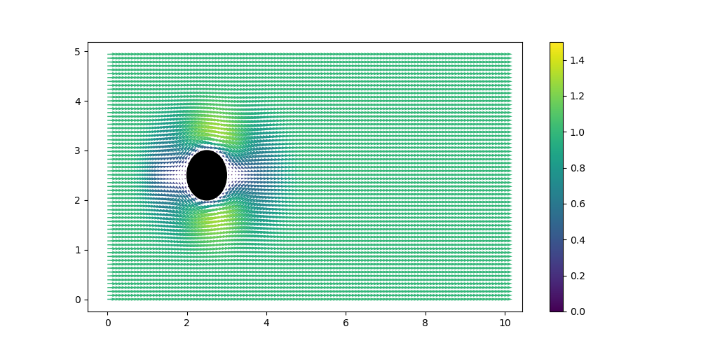
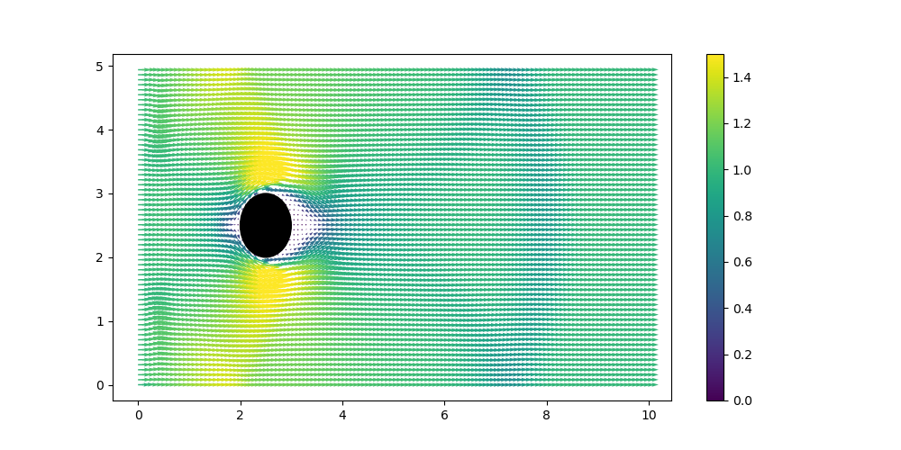
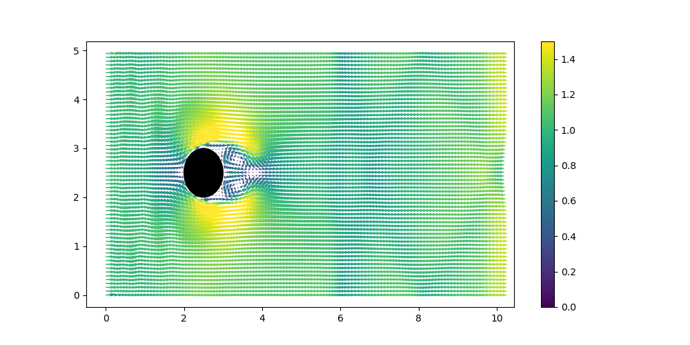
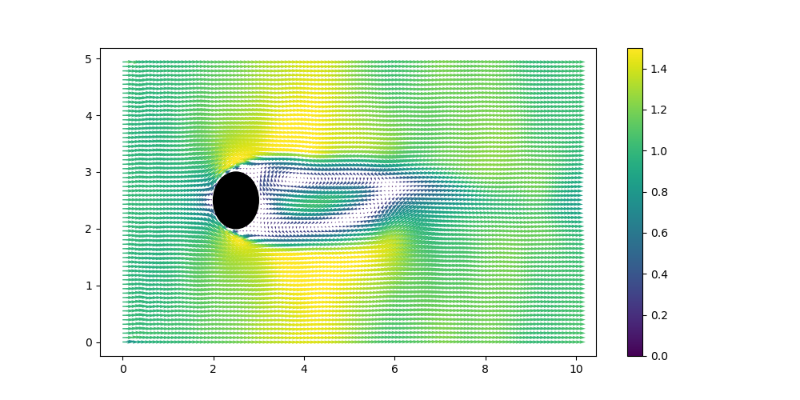

# Variational Auto Encoder with CFD
A simulation of wake behind cylinder. dimensionality reduction by variational auto encoder

## Introduction

### 1. Numerical simulation of wake behind a cylinder
This is a simple simulation of wake behind a cylinder. 
The simulation is done using Lattice Boltzmann Method. ( see `cylinder.cpp` )

The simulation is done for three different Reynolds numbers($Re = 5, 40, 200$). 

### 2. Dimensionality reduction by Variational Auto Encoder
The simulation data is then used to train an variational auto encoder to reduce the dimensionality of the data to 32-sized latent space. ( `autoencoder.py`)

### 3. Neural network to predict time integral of latent space
We then defined a neural network to predict time integral `step()` function on the latent space.
Neural network takes 32-sized latent vector **z** and Reynolds number $Re$ as input and predicts the next latent vector **z'**. ( `stepper.py` )

We will see that the neural network is able to predict the next latent vector with untrained Reynolds number.

#### TODO List
- [] Test LSTM for latent stepper - (WIP)
- [] Test Transformer for latent stepper

## Results

### Loss of VAE

### Snapshots of compressed result

Snapshot of compressed result of $Re = 200$.
One horizontal line represents compressed snapshot of specific time step, and the y-axis represents the time step.

### Loss of LatentStepper

## Result of reconstruction from latent space

### $Re = 5$

### $Re = 30$

### $Re = 150$

